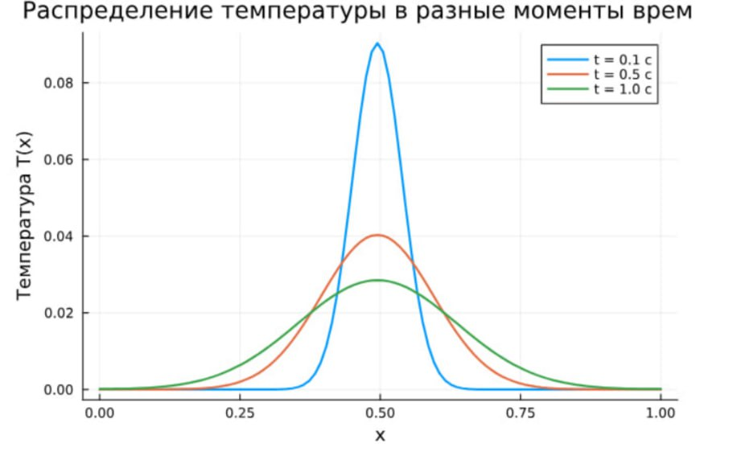

---
## Front matter
lang: ru-RU
title: Групповой проект. Этап №3. Описание программной реализации модели теплопроводности и горения.
subtitle: Теплопроводность и детерминированное горения
author:
  - Горяйнова А.А.
  - Гузева И.Н.
  - Извекова М. П.
  - Алиева М. А.
  - Шошина Е. А.
institute:
  - Российский университет дружбы народов, Москва, Россия

## i18n babel
babel-lang: russian
babel-otherlangs: english

## Formatting pdf
toc: false
toc-title: Содержание
slide_level: 2
aspectratio: 169
section-titles: true
theme: metropolis
header-includes:
 - \metroset{progressbar=frametitle,sectionpage=progressbar,numbering=fraction}
---

## Цель этапа

- Реализовать ранее разработанные алгоритмы
- Использовать языки и среды: **Julia** и **OpenModelica**
- Визуализировать результатов: отображение трёх траекторий температуры на одном графике.

---

## Выбор инструментов

- **Julia**:
  - Высокая производительность
  - Удобство реализации математики и визуализации
  - Пакеты: Plots.jl, DifferentialEquations.jl, LaTeXStrings

---


## Описание программной реализации

- Для реализации численного моделирования выбран язык Julia благодаря его высокой производительности и поддержке численных вычислений.
- Попытка моделирования в OpenModelica оказалась неудачной из-за сложностей с настройкой системы дифференциальных уравнений.
- Код основан на явной разностной схеме, представленной на этапе 2:

$$
T_i^{n+1} = T_i^n + \chi \frac{\Delta t}{h^2} (T_{i+1}^n - 2T_i^n + T_{i-1}^n) - \Delta N_i
$$

$$
\Delta N_i = -\frac{N_i^n}{\tau} e^{-E/T_i^n} \Delta t
$$

$$
N_i^{n+1} = N_i^n + \Delta N_i
$$

- Условие устойчивости: \(\chi \Delta t / h^2 < 0.5\).

---

## Код реализации

```julia
using Plots

# Параметры
L = 1.0              # Длина области
nx = 100             # Количество узлов по x
dx = L / (nx - 1)    # Шаг по пространству
dt = 0.001           # Шаг по времени
nt = 1500            # Количество временных шагов
χ = 0.01             # Коэффициент температуропроводности
τ = 0.05             # Характеристическое время реакции
Q = 1.0              # Удельное тепловыделение
E = 5.0              # Безразмерная энергия активации
```
## Код реализации
```
# Проверка условия устойчивости
stability = χ * dt / dx^2
println("Stability condition (χ dt / dx^2): ", stability)

# Инициализация массивов
x = range(0, L, length=nx)
T = zeros(nx)        # Температура
N = ones(nx)         # Концентрация реагента (начально 1)
T[nx ÷ 2] = 1.0      # Инициируем горение в середине

# Хранение снимков температуры
T_snapshots = Dict{Float64, Vector{Float64}}()
times_to_save = [0.1, 0.5, 1.0]
```
## Код реализации
```
# Моделирование
for n in 1:nt
    ΔN = -N ./ τ .* exp.(-E ./ T) * dt
    T_new = copy(T)
    for i in 2:nx-1
        T_new[i] = T[i] + χ * dt / dx^2 * (T[i+1] - 2*T[i] + T[i-1]) - ΔN[i] * Q
    end
    # Адиабатические граничные условия
    T_new[1] = T_new[3]
    T_new[end] = T_new[end-2]
    N .= N .+ ΔN
    T .= T_new

    current_time = n * dt
    if any(t -> isapprox(current_time, t; atol=1e-4), times_to_save)
        T_snapshots[current_time] = copy(T)
    end
end
```
## Код реализации
```
# Построение графика с тремя траекториями
p = plot(x, T_snapshots[0.1], label="t = 0.1 с", lw=2, xlabel="x", ylabel="T(x)", title="Распределение температуры в разные моменты времени", ylim=(0, 0.1))
plot!(p, x, T_snapshots[0.5], label="t = 0.5 с", lw=2)
plot!(p, x, T_snapshots[1.0], label="t = 1.0 с", lw=2)

# Сохранение графика
savefig(p, "temp_trajectories.png")

# Отображение графика
display(p)
```

- Горение инициировано в середине области ($ x = 0.5 $) с $ T[nx ÷ 2] = 1.0 $.
- Применены адиабатические граничные условия: $ T_0 = T_2 $, $ T_{n+1} = T_{n-1} $.
- Учтено тепловыделение с использованием коэффициента $ Q $.

---

## Визуализация

:::::: {.columns}
::: {.column width="60%"}

- Построен график с тремя траекториями температуры для моментов времени: 0.1 с, 0.5 с, 1.0 с.
- Полученный график соответствует ожидаемому распределению температуры, аналогичному представленному ранее.

:::
::: {.column width="40%"}



:::
::::::

---

## Выводы

- Численное моделирование успешно реализовано в Julia.
- График с тремя траекториями иллюстрирует динамику температуры, что подтверждает корректность реализации.

